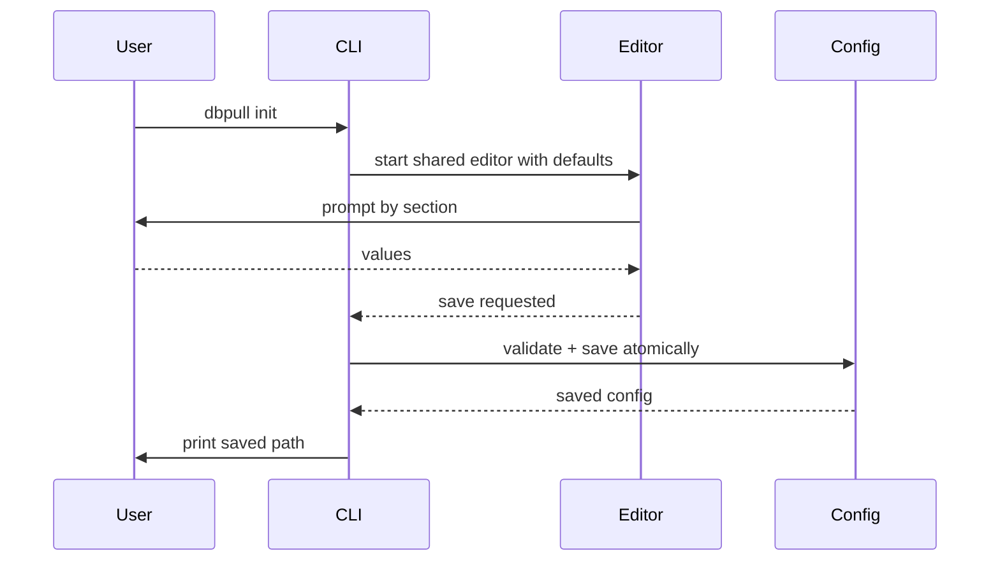
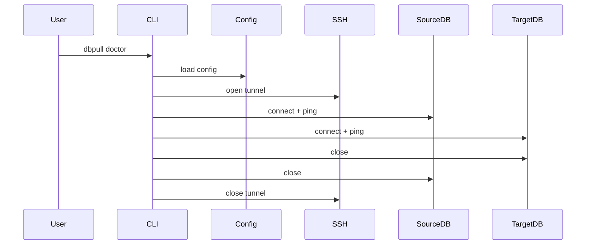
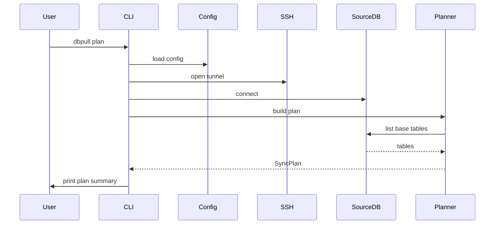
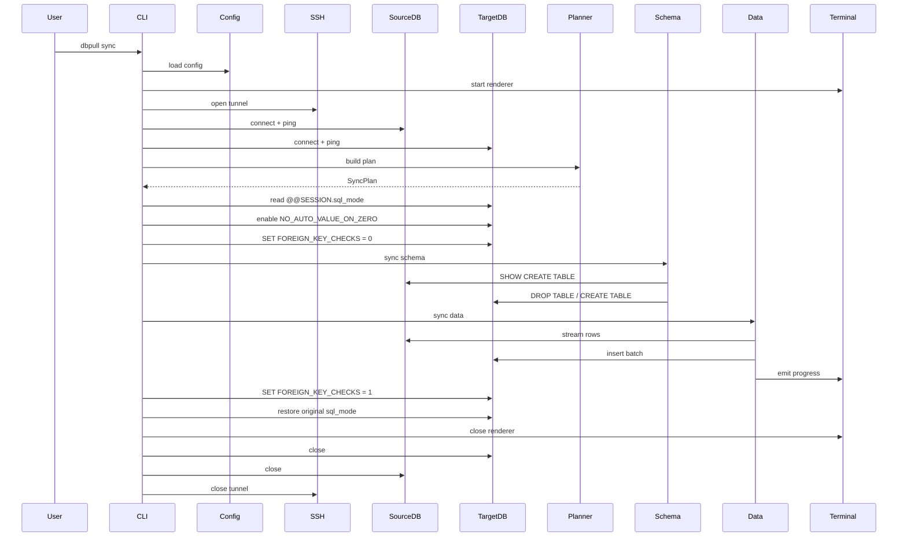

# DBPull Technical Design Document

## 1. Overview

DBPull is a Go CLI for refreshing a local database from a remote source database over SSH.

Version `0.1.x` is intentionally narrow:

- Source database: remote database reachable over SSH
- Source access: SSH tunnel only
- Target database: local database
- Sync scope: base tables only
- Sync strategy: `DROP + CREATE + INSERT`
- Execution model: sequential and fail-fast

Out of scope for this version:

- views, triggers, procedures, functions, events
- replication or CDC
- bidirectional sync
- conflict resolution
- parallel table sync

The core design goal is simple: keep the code easy to reason about, keep the UX clear, and avoid abstractions that do not solve a real problem today.

The current implementation is tested with MariaDB and MySQL.

---

## 2. Architecture

DBPull uses a small package layout:

```text
.
├── main.go
├── cmd/
└── internal/
    ├── config/
    ├── db/
    ├── ssh/
    ├── sync/
    └── terminal/
```

### Why this structure

- `main.go` only bootstraps the CLI and signal-aware context.
- `cmd/` owns Cobra commands and dependency wiring.
- `internal/config` owns config parsing, validation, editing, and persistence.
- `internal/db` owns database-specific behavior.
- `internal/ssh` owns tunnel lifecycle.
- `internal/sync` owns planning plus schema/data orchestration.
- `internal/terminal` owns sync progress rendering.

This keeps responsibilities obvious without adding service registries, plugin systems, or speculative layers.

---

## 3. Package Responsibilities

### `main.go`

Responsibility:

- create a context canceled by `Ctrl+C`
- execute the root Cobra command
- print the final error to `stderr`

Why:

- process-level concerns belong at the entrypoint
- graceful cancellation should be wired once

### `cmd`

Responsibility:

- define all CLI commands
- validate CLI arguments
- load config through the configured path
- create concrete dependencies
- orchestrate command flow

Commands currently implemented:

- `init`
- `config`
- `doctor`
- `plan`
- `sync`
- `list-tables`
- `version`

Why:

- command handlers should stay thin
- Cobra-specific code should not leak into domain packages

### `internal/config`

Responsibility:

- load `dbpull.yml`
- apply defaults
- expand `~` in `ssh.private_key`
- validate required fields and numeric values
- normalize `exclude_tables` and `exclude_data`
- provide the shared interactive config editor for `init` and `config`
- save config atomically with permission `0600`

Why:

- configuration is a separate concern
- both file persistence and interactive editing belong to the same domain

### `internal/ssh`

Responsibility:

- open the SSH client connection
- allocate a random local TCP port
- forward local connections to the remote database address
- keep the tunnel alive
- close gracefully on command completion or context cancellation

Why:

- SSH is a real infrastructure boundary with its own lifecycle and failure modes

### `internal/db`

Responsibility:

- connect to source database through an existing tunnel
- connect to target database directly
- hold one dedicated target SQL session for synchronization
- list base tables
- fetch `SHOW CREATE TABLE`
- stream source rows in batches
- insert target batches
- manage session-level `sql_mode`
- disable and re-enable `FOREIGN_KEY_CHECKS`

Why:

- database-specific behavior should stay isolated from sync orchestration

### `internal/sync`

Responsibility:

- build the synchronization plan
- classify tables as:
  - normal sync
  - schema only (`exclude_data`)
  - fully excluded (`exclude_tables`)
- execute schema sync
- execute data sync
- emit structured progress updates

Why:

- planning and synchronization are the product core
- database access stays in `internal/db`, while sync policy stays here

### `internal/terminal`

Responsibility:

- render the sync dashboard
- throttle redraws
- support TTY and non-TTY output
- report completion, cancellation, and failure cleanly

Why:

- terminal formatting should not leak into DB or sync packages

---

## 4. Current Folder Structure

```text
main.go

cmd/
  config.go
  doctor.go
  init.go
  list_tables.go
  plan.go
  root.go
  runtime.go
  sync.go
  version.go

internal/
  config/
    config.go
    editor.go
    normalize.go
    init.go

  db/
    source.go
    target.go

  ssh/
    tunnel.go

  sync/
    planner.go
    schema.go
    data.go

  terminal/
    progress.go
```

Notes:

- `cmd/runtime.go` holds the concrete dependency seams used by command tests.
- `internal/config/init.go` now focuses on defaults and atomic persistence, not a separate init flow.
- there is no `internal/ui` package in the current codebase
- there is no `service.go` in `internal/sync`

---

## 5. Configuration Model

DBPull uses one YAML file as the single source of truth.

```yaml
source:
  database: app_source
  username: remote_user
  password: source_password

ssh:
  host: db.example.com
  port: 22
  user: deploy
  private_key: ~/.ssh/id_rsa

target:
  host: 127.0.0.1
  port: 3306
  database: app_local
  username: root
  password: local_password

sync:
  batch_size: 1000
  exclude_tables: []
  exclude_data:
    - audits
    - failed_jobs
    - jobs
```

### Validation rules

- `source.database`, `source.username`, `source.password` are required
- `ssh.host`, `ssh.user`, `ssh.private_key` are required
- `target.host`, `target.database`, `target.username`, `target.password` are required
- `ssh.port` must be greater than `0`
- `target.port` must be greater than `0`
- `sync.batch_size` must be greater than `0`

### Defaults

- `ssh.port = 22`
- `target.host = 127.0.0.1`
- `target.port = 3306`
- `target.username = root`
- `sync.batch_size = 1000`
- `sync.exclude_data` gets the default starter list in `dbpull init`

### Normalization

On load or save:

- trim whitespace from string fields
- expand `~` in `ssh.private_key`
- remove duplicate exclude patterns while preserving order

### Persistence rules

- writes are atomic
- parent directories are only created when explicitly requested
- final file mode is `0600`
- config is reloaded after save so the caller receives normalized values

---

## 6. Interactive Configuration Editor

`dbpull init` and `dbpull config` reuse the same editor implementation.

### `dbpull init`

- starts from `DefaultInitConfig()`
- fails if the target file already exists unless `--force` is used
- saves only when the user chooses `Save`
- prints the created file path on success

### `dbpull config`

- loads the current config if it exists
- lets the user edit sections in memory
- validates only on save
- prompts before exit if there are unsaved changes

### Menu sections

- Source Database
- SSH
- Target Database
- Synchronization

### Synchronization section

- batch size
- exclude tables list editor
- exclude data list editor

### Why one editor

- avoids duplicate config UX
- keeps init and ongoing maintenance consistent
- reduces drift between setup and edit behavior

---

## 7. Command Flows

### `dbpull init`

1. resolve config path
2. build default config
3. launch shared config editor
4. validate on save
5. write config atomically
6. print saved path

### `dbpull config`

1. resolve config path
2. load existing config if present
3. launch shared config editor
4. validate on save
5. write config atomically

### `dbpull doctor`

1. load config
2. verify SSH key path exists
3. open tunnel
4. connect and ping source DB
5. connect and ping target DB
6. print compact status lines

### `dbpull plan`

1. load config
2. open tunnel
3. connect source DB
4. list source base tables
5. apply selected-table filter if arguments are present
6. apply `exclude_tables`
7. mark `exclude_data` tables as schema-only
8. print a compact summary

### `dbpull sync`

1. load config
2. open tunnel
3. connect source DB
4. connect target DB
5. build plan
6. prepare target sync session
7. recreate schema for all planned tables
8. copy data for non-`exclude_data` tables
9. restore target session settings
10. close progress renderer

### `dbpull list-tables`

1. load config
2. open tunnel
3. connect source DB
4. list and print base tables

---

## 8. Sequence Diagrams

### `dbpull init`



### `dbpull doctor`



### `dbpull plan`



### `dbpull sync`



---

## 9. Planning Model

`internal/sync.Planner` produces `SyncPlan`.

### Input sources

- source base table list
- optional CLI table selection
- `sync.exclude_tables`
- `sync.exclude_data`

### Output model

- `SyncPlan.Tables`
- `SyncPlan.Skipped`
- source and target database names

### Table states

#### Normal table

- schema is recreated
- data is copied

#### `exclude_data`

- schema is recreated
- data is skipped
- reported as schema-only in plan output

#### `exclude_tables`

- table is skipped entirely
- schema is not read
- target table is not touched
- data is not copied
- reported as excluded

### Matching rules

- exclusion patterns use glob matching through `filepath.Match`
- selected-table CLI arguments are exact table-name matches after trimming whitespace

### Why this model

- one plan is shared by both `plan` and `sync`
- full exclusion and schema-only exclusion have different meanings and should stay explicit

---

## 10. SSH Tunnel Lifecycle

### Lifecycle

1. read private key
2. open SSH client
3. listen on `127.0.0.1:0`
4. expose the chosen local address
5. proxy local TCP connections to the remote database address
6. send keepalive requests on an interval
7. close automatically on:
   - normal command completion
   - explicit `Close()`
   - context cancellation
   - keepalive failure

### Cleanup behavior

- listener and SSH client are both closed
- `Close()` is idempotent
- goroutines wait for shutdown before returning

### Interface choice

`Tunnel` remains an interface because it is a real external boundary and a useful seam for command tests.

---

## 11. Database Lifecycle

### Source connection

- built from the forwarded local tunnel address
- read-only in practice
- used for:
  - table discovery
  - `SHOW CREATE TABLE`
  - row streaming

### Target connection

- built directly from local target config
- destructive write path
- one dedicated SQL connection is opened and reused for sync
- used for:
  - `DROP TABLE`
  - `CREATE TABLE`
  - batch inserts
  - FK check toggling
  - session `sql_mode` management

### Connection policy

- connections are per command
- no shared long-lived process state
- cleanup uses local `defer` near resource creation

---

## 12. Schema Synchronization

Schema sync is intentionally simple.

For each planned table:

1. read `SHOW CREATE TABLE` from source
2. run `DROP TABLE IF EXISTS` on target
3. run the source `CREATE TABLE` on target

### Foreign key handling

- `FOREIGN_KEY_CHECKS` is disabled before schema sync starts
- it remains disabled through the data phase
- it is re-enabled after data sync finishes
- a deferred safeguard attempts restoration even on failure

### Dedicated target session

Schema sync and data sync share the same dedicated target SQL session.

This matters because session settings such as:

- `FOREIGN_KEY_CHECKS`
- `sql_mode`

must stay consistent for every `DROP TABLE`, `CREATE TABLE`, and `INSERT`.

### Why this approach

- avoids dependency graph logic
- matches the product contract of rebuilding target tables from source

---

## 13. Data Synchronization

Data sync streams batches from source and inserts them into target.

### Flow

For each planned table that is not `exclude_data`:

1. start table progress
2. stream rows from source
3. insert batch into target
4. update cumulative progress
5. stop on first error

### Batch sizing

Configured batch size is adjusted per table to avoid prepared-statement placeholder limits.

Formula:

```text
maxRowsByColumns = floor(60000 / columnCount)
effectiveBatchSize = min(configuredBatchSize, maxRowsByColumns)
effectiveBatchSize >= 1
```

### Why this exists

- wide tables can exceed prepared statement placeholder limits
- per-table adjustment is safer than global mutation

### Value preservation rules

During row scan and insert:

- explicit `0` values in `AUTO_INCREMENT` columns stay `0`
- SQL `NULL` stays `nil`
- empty string stays empty string
- empty `[]byte{}` stays a non-nil empty byte slice
- non-empty binary values stay `[]byte`
- zero numeric values stay zero
- `false` / tinyint zero stays zero
- date and time values rely on the MySQL-compatible driver with `ParseTime=true`
- Unicode text is passed through without normalization

### SQL mode handling

Before schema or data changes begin on the target session:

- read the current session `sql_mode`
- add `NO_AUTO_VALUE_ON_ZERO` if it is not already enabled
- preserve all other existing SQL modes

After synchronization ends, whether it succeeds, fails, or is cancelled:

- restore `FOREIGN_KEY_CHECKS`
- restore the original session `sql_mode`
- close the dedicated session

### Why `NO_AUTO_VALUE_ON_ZERO` is required

MariaDB and MySQL normally treat explicit `0` inserted into an `AUTO_INCREMENT` column as a request for the next generated value.

That behavior breaks synchronization fidelity because:

- a source row with primary key `0` stops being `0` on the target
- any foreign key referencing `0` can become invalid
- the synchronized database is no longer identical to the source

DBPull therefore enables `NO_AUTO_VALUE_ON_ZERO` for the sync session so explicit zero values are preserved exactly as stored in the source database.

### Failure policy

- stop on the first failing table or batch
- do not continue to later tables
- include table and batch context in the error
- do not leak raw row values or passwords in error text

---

## 14. Progress Reporting

The sync dashboard is overall-progress-oriented.

### TTY output

The interactive dashboard shows:

- product title
- compact phase line
- one overall progress bar
- completed tables / total planned tables
- cumulative copied rows
- smoothed rows per second
- elapsed time
- ETA

Current table names are not shown in the normal dashboard.

### Percentage model

Overall percentage is authoritative from:

```text
completedTables / totalPlannedTables
```

Row estimates are not used for the denominator.

### Speed and ETA

- speed is smoothed with an exponential moving average
- ETA is derived from completed-table rate
- ETA is hidden until it becomes meaningful

### Throttling

- TTY redraws: at most every `500ms`
- non-TTY output: at most every `10s`
- final, failure, and cancellation states force a clean render

### Verbose mode

Normal mode hides low-level messages.

Verbose mode allows operational messages such as per-table batch-size adjustment notices.

### Non-TTY mode

When stdout is not a TTY:

- ANSI redraws are disabled
- compact periodic lines are printed instead

---

## 15. Error Handling Strategy

### Principles

- fail early on config problems
- fail fast on sync problems
- wrap errors with step context
- preserve the primary failure
- still attempt cleanup

### Expected error shape

Errors should explain:

- what step failed
- what resource failed
- which table failed, when relevant

Examples:

- `open ssh tunnel: ...`
- `sync schema for "users": ...`
- `sync data for "orders": ...`

### Sensitive data rule

Passwords must not appear in:

- command output
- progress output
- batch-insert errors

---

## 16. Resource Cleanup Strategy

Cleanup is local and `defer`-based.

### Reverse-order cleanup

Resources are closed in reverse acquisition order:

1. renderer
2. target session restoration attempt
3. target DB session
4. target DB handle
5. source DB
6. SSH tunnel

### Guarantees

Even on failure or cancellation:

- SSH tunnel close is attempted
- source DB close is attempted
- target DB close is attempted
- FK restoration is attempted if checks were disabled
- original target `sql_mode` is restored if it was changed
- renderer is finalized cleanly

### Why this approach

- short-lived CLI processes do not need a lifecycle manager
- local `defer` is easier to audit

---

## 17. Concurrency Decisions

### Application-level policy

DBPull does not parallelize tables in `0.1.x`.

### Why

- simpler destructive semantics
- easier progress reporting
- easier failure handling
- no dependency ordering logic needed

### Internal concurrency that still exists

- SSH forwarding goroutines
- network I/O managed by the standard library
- renderer goroutine used by the progress dashboard

This is implementation detail, not parallel table execution.

---

## 18. Dependency Rules

### Allowed direction

- `main.go` -> `cmd`
- `cmd` -> all internal packages
- `internal/sync` -> config model + DB-facing seams
- `internal/db` -> config types
- `internal/ssh` -> config types
- `internal/terminal` -> sync progress events

### Forbidden direction

- `internal/db` must not import `internal/sync`
- `internal/ssh` must not import `internal/sync`
- `internal/config` must not open DB or SSH connections
- `internal/terminal` must not perform DB work
- no cyclic dependencies

### Why

- keeps layers readable
- keeps infrastructure concerns separate from orchestration and rendering

---

## 19. Testing Strategy

### Current focus

The test suite emphasizes behavior over abstraction coverage.

### Covered areas

- config parsing, defaults, validation, path expansion, atomic save, and `0600`
- shared config editor behavior
- SSH tunnel lifecycle and cancellation
- source row scanning and batch-size adjustment
- target insert behavior and safe errors
- planner behavior for selected, excluded, and schema-only tables
- schema sync behavior
- data sync behavior and fail-fast semantics
- terminal progress rendering, throttling, cancellation, and non-TTY output
- command wiring for config editor reuse and `--config`

### Gaps

- no live end-to-end SSH + database integration test yet
- no packaged release smoke test yet

Those are release-process concerns, not architecture blockers.

---

## 20. Key Design Decisions

### Concrete types by default

Used because the codebase has one implementation for most components.

### One shared config editor

Used to avoid divergent behavior between `init` and `config`.

### One true early interface: `Tunnel`

Kept because SSH is a real boundary and a valuable test seam.

### Sequential sync

Used because it is easier to understand and safer for destructive refreshes.

### `DROP + CREATE + INSERT`

Used because it gives a predictable local target state.

### Base tables only

Used to keep scope controlled and implementation simple.

### File-based config only

Used because one YAML file is enough for this CLI.

---

## 21. Final Assessment

The current DBPull design is intentionally boring:

- one CLI
- one config file
- one tunnel
- one source DB
- one target DB
- one sequential sync flow

That is the correct trade-off for `0.1.x`. The project stays maintainable because it resists speculative abstractions and keeps operational behavior explicit.
